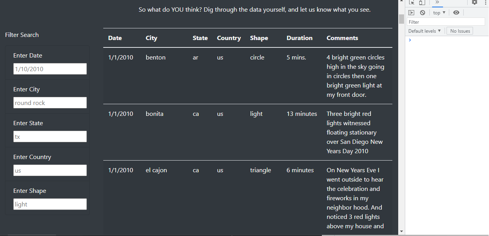
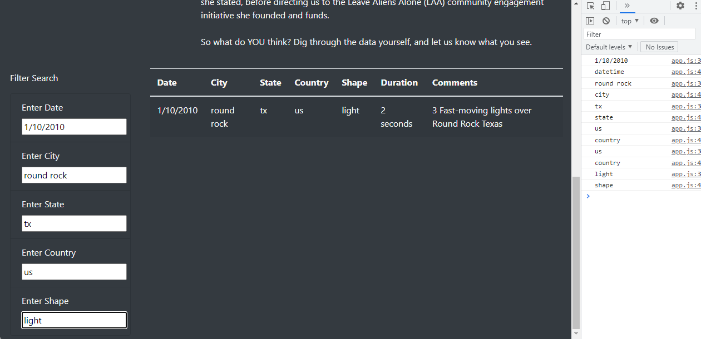
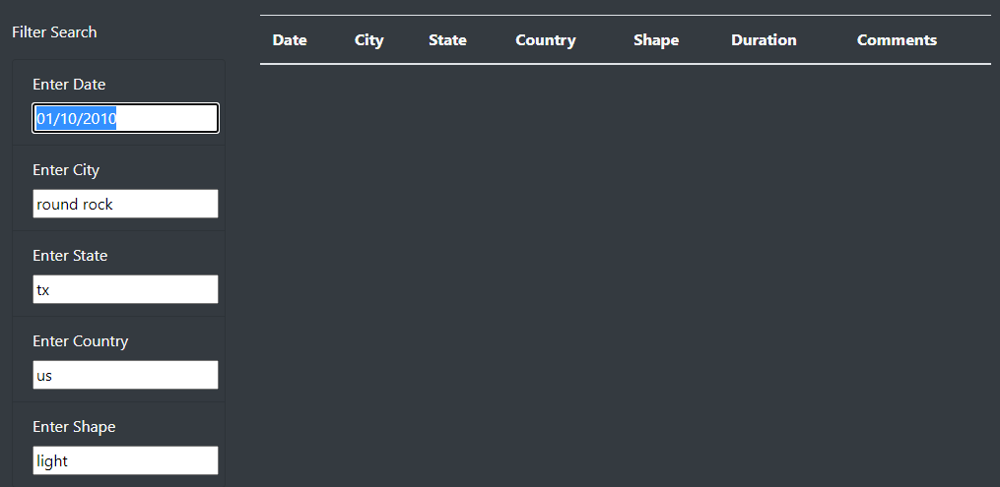
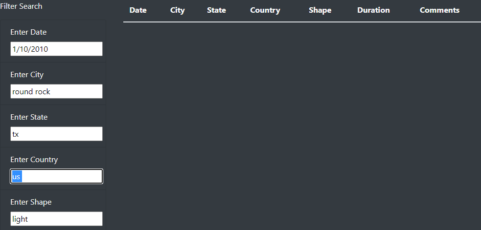

# UFO-Challenge
Using JavaScript and HTML to filter data and update websites on the fly.

## Purpose
Using JavaScript with HTML to provide indepth analysis of a data set using multiple filters at the same time to create a snapshot of UFO sightings in the USA. Show the results of the analysis, the applicability of them, and how the results could be used for the website's owner. Finally, suggest future expansions of the filters and how the code could be improved in the future.

## Results
When you first enter the website the default filter categories are as follows:

When you fill in the filters with the placeholder information, one result comes up:

This effectively shows that the table is being properly filtered to give very specific results for each of the categories. The webpage owner and users can use each of these categories to get results in their area, or in any area of interest for UFO sightings. They can use the shape category to compare their own experiences and see if their experiences have been replicated in other areas. This set of filters of the data set could be used by the owner of the website to create an interesting user experience or become a publically accessible database.

## Summary
While the results are exactly what we wanted, the filters could be improved as in this current state they have some significant drawbacks. The first is the accuracy of what the user types in must be exact and match up perfectly with the syntax of the data set. 

This drawback can be seen when you type in a date:

Here a zero is added to the date for the day and the results return nothing.

In all boxes when a space is added to the end of any string:

Adding code that trims spaces off the end of queries would solve this.

And when capital letters are used when the dataset is solely in lower case:

This could again be solved by adding a conversion function to the query.

Overall, the code does exactly what was asked by the stakeholder, and yet it could require some extra work as well as refinement to make the filters work more effectively and efficiently.
